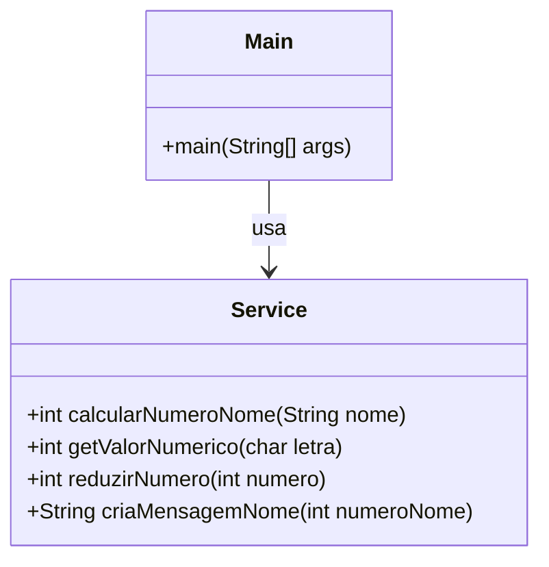

# SeuNomeNaNumerologia

## 📖 Descrição do Projeto
O projeto **SeuNomeNaNumerologia** calcula o valor numérico de um nome utilizando princípios de numerologia e gera uma interpretação desse número, explorando aspectos pessoais e profissionais. Desenvolvido para fins educativos e como exercício de programação, ele oferece uma visão divertida sobre o tema.

## 📂 Estrutura
```bash
SeuNomeNaNumerologia/
├── src/
│   ├── Main.java            # Classe principal que lida com entrada do usuário e exibe resultados
│   └── Service.java         # Classe de serviço que contém a lógica de cálculo e interpretação do número
└── README.md                # Arquivo com informações do projeto

```

## Diagrama de classes


## Funcionalidades
1. **Entrada de Nome:** Solicita o primeiro nome do usuário e converte-o em letras maiúsculas.
2. **Cálculo do Número:**
- Conversão das Letras: Cada letra é convertida para um valor numérico de acordo com uma tabela de numerologia.
- Redução do Número: A soma dos valores das letras é reduzida a um único dígito, exceto para os números mestres 11 e 22.
5. **Mensagem Interpretativa:** Exibe uma mensagem relacionada ao número resultante, oferecendo uma breve interpretação do valor segundo a numerologia.

## Como Usar
1. Clone o repositório:
`git clone https://github.com/chrissperb/SeuNomeNaNumerologia.git`
2. Compile e execute o programa:
`javac Main.java`
`java Main`
3. Digite seu primeiro nome quando solicitado e veja o número e a interpretação associados.

## Referência
Projeto inspirado em numerologia, com lógica baseada em [WikiHow](https://pt.wikihow.com/Calcular-o-N%C3%BAmero-do-seu-Nome-na-Numerologia).
