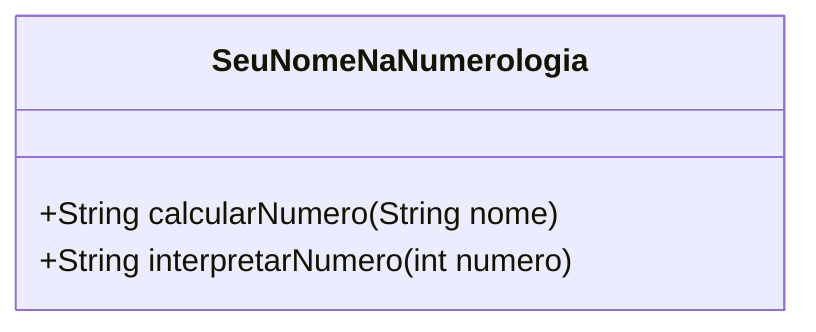

# SeuNomeNaNumerologia

## 📖 Descrição do Projeto
O projeto **SeuNomeNaNumerologia** calcula o valor numérico de um nome utilizando princípios de numerologia e gera uma interpretação desse número, explorando aspectos pessoais e profissionais. Desenvolvido para fins educativos e como exercício de programação, ele oferece uma visão divertida sobre o tema.

## 📂 Estrutura de Pastas
```bash
SeuNomeNaNumerologia/
├── .idea/                  # Configurações do IntelliJ
├── src/
│   └── main/
│       └── java/
│           └── br/
│               └── ce/
│                   └── wcaquino/
│                       └── SeuNomeNaNumerologia.java  # Código principal
├── .gitignore              # Arquivo para ignorar arquivos no Git
└── SeuNomeNaNumerologia.iml # Configuração do projeto
```

## Diagrama de classes


## Referência
Projeto inspirado em numerologia, com lógica baseada em [WikiHow](https://pt.wikihow.com/Calcular-o-N%C3%BAmero-do-seu-Nome-na-Numerologia).
